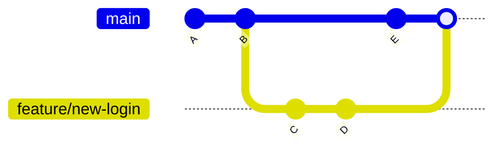

```mermaid
gitGraph
   commit id: "A"
   commit id: "B"
   branch feature/new-login
   checkout feature/new-login
   commit id: "C"
   commit id: "D"
   checkout main
   commit id: "E"
   merge feature/new-login
```